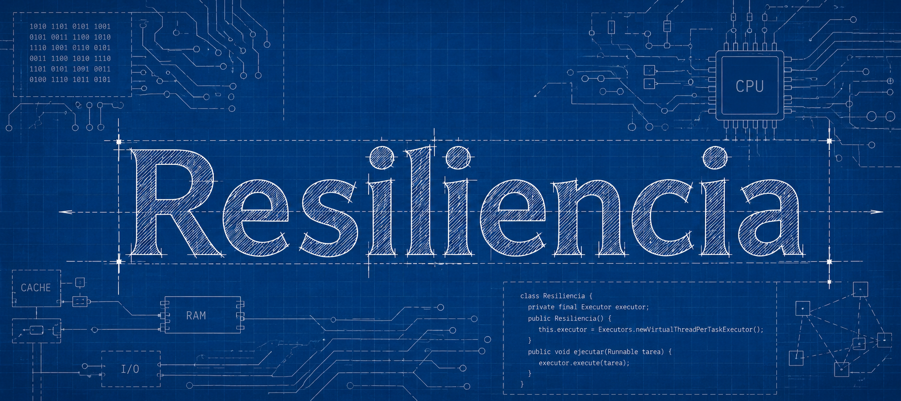

# resiliencia



> A resilience tool engineered to endure.

[](https://opensource.org/licenses/Apache-2.0)
[](https://openjdk.org/projects/jdk/21/)
[](https://central.sonatype.com/artifact/io.github.teceli/resiliencia)
[](https://github.com/tec-eli/resiliencia/actions/workflows/build.yml)
[](https://github.com/tec-eli/resiliencia/actions/workflows/security-scan.yml)
[](https://securityscorecards.dev/viewer/?uri=github.com/tec-eli/resiliencia)
[](https://sonarcloud.io/summary/new_code?id=tec-eli_resiliencia)

**[Website & API docs →](https://tec-eli.github.io/resiliencia/)**

**resiliencia** is not a port of resilience4j. It is a new library that treats Java 21 as a baseline — not a target. 
Virtual threads are the foundation, not an option. The Java Module System is enforced from the first commit. The API is
designed around modern Java idioms: sealed interfaces, records, and pattern matching.

---

## Quick start

```xml
<dependency>
    <groupId>io.github.teceli</groupId>
    <artifactId>resiliencia-compose</artifactId>
    <version>1.0.0</version>
</dependency>
```

### Single pattern

```java
var retry = Retry.of(3)
    .waitDuration(Duration.ofMillis(500))
    .retryOn(IOException.class);

String result = retry.call(() -> api.fetch());
```

### Composed policy

```java
var policy = Policy.with(circuitBreaker)
                   .then(retry)
                   .then(timeout);

// Blocking
String result = policy.call(() -> api.fetch());

// Async
CompletableFuture<String> future = policy.callAsync(() -> api.fetch());

// No exceptions — returns a typed result
Outcome<String> outcome = policy.outcome(() -> api.fetch());

switch (outcome) {
    case Success<String> s  -> System.out.println(s.value());
    case Failure<String> f  -> System.out.println("Error: " + f.cause().getMessage());
    case TimedOut<String> t -> System.out.println("Timed out");
}
```

---

## Patterns

| Pattern        | Module                    | Description                                      |
|----------------|---------------------------|--------------------------------------------------|
| Retry          | resiliencia-patterns      | Retries with configurable backoff                |
| Timeout        | resiliencia-patterns      | Real cancellation via virtual threads            |
| CircuitBreaker | resiliencia-patterns      | Closed / Open / HalfOpen state machine           |
| Bulkhead       | resiliencia-patterns      | Concurrency limiter via semaphore                |
| RateLimiter    | resiliencia-patterns      | Call frequency limiter                           |
| Policy         | resiliencia-compose       | Explicit composition of multiple patterns        |

---

## Design principles

- **Java 21 is the baseline.** No compatibility shims, no legacy paths.
- **Virtual threads are not optional.** All blocking operations run on virtual threads.
- **Immutable configuration.** Pattern objects are created once and reused safely across threads.
- **No global registry.** No hidden singletons. You own your instances.
- **Unchecked exceptions only.** No checked exceptions in the public API.
- **Zero external dependencies** in `resiliencia-core` and `resiliencia-patterns`.

---

## Requirements

- Java 21 or higher
- Maven 3.9+

---

## License

Apache 2.0 — see [LICENSE](LICENSE).
